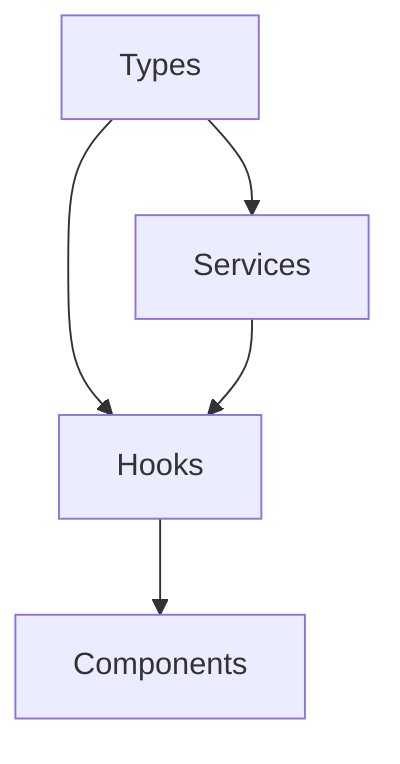

# Application Architecture Documentation

## Overview
This document explains the architecture of the Stadium Booking application, focusing on the relationship between Types, Services, and Hooks.

## Directory Structure
```
src/
├── types/           # TypeScript interfaces and types
├── services/        # API and data operation services
├── hooks/           # React custom hooks
└── components/      # React components
```

## 1. Types (`types/`)
Types define the shape of our data and ensure type safety throughout the application.

### Example: Authentication Types
```typescript
// types/auth.ts
interface User {
  id: string
  email: string
  name: string
  role: 'user' | 'admin'
}

interface LoginCredentials {
  email: string
  password: string
}

interface AuthResponse {
  user: User
  token: string
}
```

## 2. Services (`services/`)
Services handle API calls and data operations. They are pure functions that don't contain React-specific code.

### Example: Authentication Service
```typescript
// services/authService.ts
const authService = {
  async login(credentials: LoginCredentials): Promise<AuthResponse> {
    // Implementation
  },
  
  async register(credentials: RegisterCredentials): Promise<AuthResponse> {
    // Implementation
  },
  
  async logout(): Promise<void> {
    // Implementation
  }
}
```

## 3. Hooks (`hooks/`)
Hooks manage React state and side effects, using services to perform operations.

### Example: User Authentication Hook
```typescript
// hooks/useUser.ts
const useUser = () => {
  const [user, setUser] = useState<User | null>(null);
  
  const login = async (credentials: LoginCredentials) => {
    const response = await authService.login(credentials);
    setUser(response.user);
  };
  
  return { user, login };
};
```

## 4. Components
Components use hooks to access services and manage UI state.

### Example: Login Component
```typescript
// components/LoginForm.tsx
const LoginForm = () => {
  const { login, error } = useUser();
  
  const handleSubmit = async (formData: LoginCredentials) => {
    try {
      await login(formData);
    } catch (err) {
      // Handle error
    }
  };
  
  return (
    <form onSubmit={handleSubmit}>
      {/* Form fields */}
    </form>
  );
};
```

## Data Flow
1. Components call hooks
2. Hooks use services
3. Services perform operations
4. Types ensure data consistency



## Best Practices

### 1. Type Safety
- Always define interfaces for your data
- Use TypeScript's type checking
- Avoid using `any` type

### 2. Service Layer
- Keep services pure and stateless
- Handle all API calls in services
- Use proper error handling
- Document service methods

### 3. Hooks
- Keep hooks focused on a single responsibility
- Use proper dependency arrays
- Handle loading and error states
- Provide clear return values

### 4. Components
- Use hooks for data fetching and state management
- Keep components focused on UI
- Use proper prop types
- Handle loading and error states

## Example Implementation

### 1. Define Types
```typescript
// types/booking.ts
interface Booking {
  id: string
  userId: string
  eventId: string
  seats: string[]
  status: 'pending' | 'confirmed' | 'cancelled'
}
```

### 2. Create Service
```typescript
// services/bookingService.ts
const bookingService = {
  async createBooking(booking: Omit<Booking, 'id'>): Promise<Booking> {
    // Implementation
  },
  
  async getBookings(userId: string): Promise<Booking[]> {
    // Implementation
  }
}
```

### 3. Create Hook
```typescript
// hooks/useBookings.ts
const useBookings = (userId: string) => {
  const [bookings, setBookings] = useState<Booking[]>([]);
  
  useEffect(() => {
    const fetchBookings = async () => {
      const userBookings = await bookingService.getBookings(userId);
      setBookings(userBookings);
    };
    
    fetchBookings();
  }, [userId]);
  
  return { bookings };
};
```

### 4. Use in Component
```typescript
// components/BookingList.tsx
const BookingList = ({ userId }: { userId: string }) => {
  const { bookings } = useBookings(userId);
  
  return (
    <div>
      {bookings.map(booking => (
        <BookingCard key={booking.id} booking={booking} />
      ))}
    </div>
  );
};
```

## Common Patterns

### 1. Data Fetching
```typescript
// hooks/useData.ts
const useData = <T>(fetchFn: () => Promise<T>) => {
  const [data, setData] = useState<T | null>(null);
  const [loading, setLoading] = useState(true);
  const [error, setError] = useState<string | null>(null);
  
  useEffect(() => {
    const fetchData = async () => {
      try {
        const result = await fetchFn();
        setData(result);
      } catch (err) {
        setError(err.message);
      } finally {
        setLoading(false);
      }
    };
    
    fetchData();
  }, [fetchFn]);
  
  return { data, loading, error };
};
```

### 2. Form Handling
```typescript
// hooks/useForm.ts
const useForm = <T>(initialValues: T) => {
  const [values, setValues] = useState<T>(initialValues);
  
  const handleChange = (e: React.ChangeEvent<HTMLInputElement>) => {
    const { name, value } = e.target;
    setValues(prev => ({ ...prev, [name]: value }));
  };
  
  return { values, handleChange };
};
```

## Testing Guidelines

### 1. Types
- No need to test types directly
- TypeScript compiler will catch type errors

### 2. Services
- Test API calls and data transformations
- Mock external dependencies
- Test error handling

### 3. Hooks
- Test state management
- Test side effects
- Use React Testing Library

### 4. Components
- Test UI rendering
- Test user interactions
- Test prop handling

## Conclusion
This architecture provides a clean separation of concerns and makes the codebase more maintainable and scalable. By following these patterns, you can ensure type safety, proper data flow, and clean component structure throughout your application. 