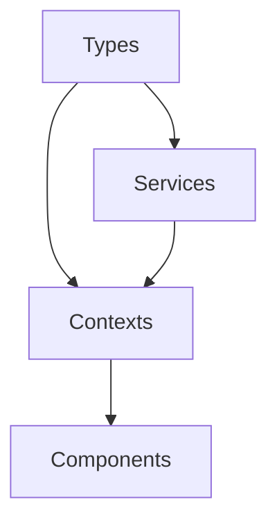

# Application Architecture Documentation

## Overview
This document explains the architecture of the Stadium Booking application, focusing on the relationship between Types, Services, Contexts, and Components.

## Directory Structure
```
src/
├── types/           # TypeScript interfaces and types
├── services/        # API and data operation services
├── contexts/        # React Context providers
├── components/      # React components
├── pages/          # Page components
├── routes/         # Router configuration
├── utils/          # Utility functions
└── config/         # Configuration files
```

## 1. Types (`types/`)
Types define the shape of our data and ensure type safety throughout the application.

### Authentication Types
```typescript
// types/auth.ts
interface User {
  id: string
  email: string
  name: string
  role: 'user' | 'admin'
}

interface AuthState {
  user: User | null
  token: string | null
  isAuthenticated: boolean
  loading: boolean
  error: string | null
}

interface LoginCredentials {
  email: string
  password: string
}

interface RegisterCredentials {
  name: string
  email: string
  password: string
}
```

## 2. Services (`services/`)
Services handle API calls and data operations. They are pure functions that don't contain React-specific code.

### Authentication Service
```typescript
// services/authService.ts
const authService = {
  async login(credentials: LoginCredentials): Promise<AuthResponse> {
    const response = await fetch(`${API_URL}/auth/login`, {
      method: 'POST',
      headers: { 'Content-Type': 'application/json' },
      body: JSON.stringify(credentials)
    });
    // Error handling and response processing
  },
  
  async register(credentials: RegisterCredentials): Promise<AuthResponse> {
    // Implementation
  },
  
  async logout(): Promise<void> {
    // Implementation
  }
}
```

## 3. Contexts (`contexts/`)
Contexts provide global state management and share data across components.

### Authentication Context
```typescript
// contexts/AuthContext.tsx
const AuthContext = createContext<AuthContextType | undefined>(undefined);

export const AuthProvider: React.FC<{ children: React.ReactNode }> = ({ children }) => {
  const [state, setState] = useState<AuthState>({...});
  
  // Authentication methods
  const login = async (credentials: LoginCredentials) => {...};
  const register = async (credentials: RegisterCredentials) => {...};
  const logout = async () => {...};
  
  return (
    <AuthContext.Provider value={{...state, login, register, logout}}>
      {children}
    </AuthContext.Provider>
  );
};
```

## 4. Routes (`routes/`)
Routes handle navigation and protect routes based on authentication status.

### Route Protection
```typescript
// utils/routeUtils.ts
export const withAuthCheck = (Component: React.ComponentType, requiredRole?: string) => {
  return function WithAuthCheckWrapper() {
    const { isAuthenticated, user, loading } = useAuthContext();
    // Authentication check and redirection logic
  };
};
```

### Route Configuration
```typescript
// routes/protectedRoutes.tsx
export const protectedRoutes: RouteType[] = [
  {
    path: '/dashboard',
    element: <ProtectedDashboard />
  },
  // Other protected routes
];
```

## API Implementation Techniques

### 1. Service Layer Pattern
- Services handle all API communication
- Centralized error handling
- Consistent response processing
- Type-safe request/response handling

### 2. Authentication Flow
1. User submits credentials
2. Service makes API call
3. Context updates state
4. Local storage persists session
5. Protected routes check authentication

### 3. Error Handling
- Service layer catches API errors
- Context manages error state
- Components display error messages
- Consistent error format across application

### 4. State Management
- Context provides global state
- Services handle data operations
- Components consume state through hooks
- Local storage for persistence

## Best Practices

### 1. Type Safety
- Define interfaces for all data structures
- Use TypeScript's strict mode
- Validate API responses
- Handle null/undefined cases

### 2. API Calls
- Centralize API endpoints
- Use consistent error handling
- Implement retry logic for failed requests
- Cache responses when appropriate

### 3. Authentication
- Secure token storage
- Automatic token refresh
- Role-based access control
- Session persistence

### 4. Routing
- Protect sensitive routes
- Handle loading states
- Implement proper redirects
- Maintain route history

## Example Implementation

### 1. API Call
```typescript
// services/bookingService.ts
const bookingService = {
  async createBooking(booking: BookingRequest): Promise<Booking> {
    const response = await fetch(`${API_URL}/bookings`, {
      method: 'POST',
      headers: {
        'Content-Type': 'application/json',
        'Authorization': `Bearer ${token}`
      },
      body: JSON.stringify(booking)
    });
    
    if (!response.ok) {
      throw new Error('Booking creation failed');
    }
    
    return response.json();
  }
};
```

### 2. Context Usage
```typescript
// components/BookingForm.tsx
const BookingForm = () => {
  const { user, token } = useAuthContext();
  
  const handleSubmit = async (formData: BookingFormData) => {
    try {
      const booking = await bookingService.createBooking({
        ...formData,
        userId: user.id
      });
      // Handle success
    } catch (error) {
      // Handle error
    }
  };
  
  return <form onSubmit={handleSubmit}>{/* Form fields */}</form>;
};
```

## Testing Guidelines
- Mock API calls in tests
- Test authentication flows
- Verify route protection
- Check error handling



## Conclusion
This architecture provides a clean separation of concerns and makes the codebase more maintainable and scalable. By following these patterns, you can ensure type safety, proper data flow, and clean component structure throughout your application. 